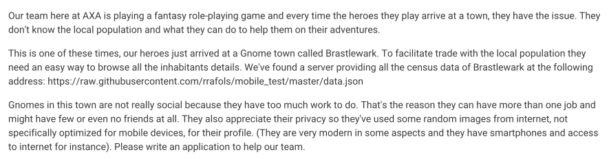

<h1 align="center">React project using census data 👋</h1>
<p>
  
  <a href="#" target="_blank">
    
  </a>
</p>

### Description



### ✨ <a href="https://gnomes-aqa7s7uoga-uc.a.run.app" target="_blank">Demo</a>

## Install

```sh
npm i
```

## Usage

```sh
npm start
```

## Show your support

Give a ⭐️ if this project helped you!

***
_This README was generated with ❤️ by [readme-md-generator](https://github.com/kefranabg/readme-md-generator)_